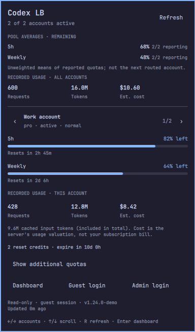

+++
date = '2026-09-14T12:00:00+02:00'
draft = false
title = 'I built a little Codex LB panel for Omarchy'
summary = 'Getting back to the blog with something I built: an Omarchy panel for checking codex-lb quotas without opening the dashboard.'
tags = ['omarchy', 'quickshell', 'codex-lb', 'open-source']
categories = ['projects']
+++

The last couple of posts here were about a paneer omelette and okra fry. Then I left the blog alone for a bit. Well, more than a bit.

I want to start writing here again, and I've got a couple of Omarchy plugins to talk about. First up: **Codex LB for Omarchy**.

If you use [codex-lb](https://github.com/Soju06/codex-lb), you'll know the dashboard is where you can check on your account pool. But sometimes all you need is a quick look at how much quota is left before getting back to work. That's what this little bar panel is for.



*The preview uses fictional accounts.*

Click the icon and you can see which accounts are available, how much quota remains, and when the limits reset. There's an overview of the pool, and you can step through individual accounts when you want a closer look.

By default, it takes up just an icon in the bar. If you prefer having the numbers visible all the time, there are display modes for that too. You can also turn on low-quota notifications; they're off by default.

## A couple of details that matter

Take a pool where only two out of three active accounts have reported a quota. Treating the third as empty would make the average misleading. The panel averages the known values and shows the reporting count alongside them, so you can see how much information you're working with.

The percentages show what's **remaining**. Request and token totals come from the server's recorded usage, and the cost figure is its estimate of that usage's value. It isn't your subscription bill.

Everything here is read-only. When you need to manage accounts, you can open the dashboard straight from the panel.

## Give it a try

You'll need Omarchy's Quattro/Quickshell desktop, Python 3.10 or newer, and a running codex-lb dashboard. This version won't work on the older Waybar desktop.

```sh
omarchy plugin add https://github.com/janaki-sasidhar/omarchy-codex-lb --enable
```

Once it's installed, set your dashboard address in Omarchy's bar settings. It starts with `http://127.0.0.1:2455`; use HTTPS if your server is on another machine. If your dashboard needs a login, you'll find the login buttons in the panel.

**A small tip:** if you're sharing your screen, the `hideAccountNames` setting replaces the names with Account 1, Account 2, and so on.

The [README](https://github.com/janaki-sasidhar/omarchy-codex-lb#readme) has the rest of the settings, keyboard controls, and removal instructions.

This one [made it into the marketplace on September 8, 2026](https://github.com/omacom/omarchy-plugin-marketplace/issues/5622#issuecomment-5583953845). You can find the [listing here](https://omarchyplugins.com/plugin.html?id=janaki-sasidhar.codex-lb) and the [code on GitHub](https://github.com/janaki-sasidhar/omarchy-codex-lb).

If you use it and something feels awkward or a number doesn't make sense, [open an issue](https://github.com/janaki-sasidhar/omarchy-codex-lb/issues). Tell me what you expected to see. That helps.
