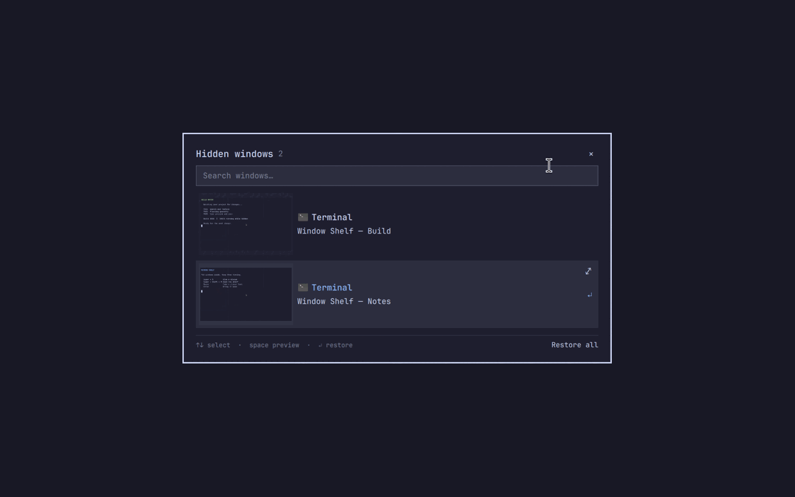

+++
date = '2026-09-14T12:05:00+02:00'
draft = false
title = 'Window Shelf: put that window away for a while'
summary = 'Another Omarchy plugin I built: hide a window, leave its app running, and find it again with search and live previews.'
tags = ['omarchy', 'hyprland', 'quickshell', 'open-source']
categories = ['projects']
+++

You've got a terminal running something, a browser window you'll need later, and something else you actually want to focus on now. Closing the first two would be inconvenient. Leaving them in the way isn't great either.

**Window Shelf** is another Omarchy plugin I built. It gives those windows somewhere to go until you need them again. Their apps keep running while they're tucked away.



*A synthetic demo of the picker and preview controls.*

## Putting a window on the shelf

Press **Super+M** on the window you want to hide. When you want it back, press **Super+Shift+M** to open the picker, type part of the app name or window title, and hit **Enter** on the result.

It comes back onto the workspace you're on, ready to use. There's also a **Restore all** button for bringing everything back together.

Underneath, this uses a named Hyprland special workspace. Hiding a window doesn't suspend its process, so audio can keep playing and commands can keep running. It also doesn't save your apps for a reboot; the shelf belongs to the current desktop session.

## Which window was it, again?

Search gets you a long way, but similar window titles can still leave you guessing. That's where Quick Look comes in.

Select a window and press **Space** to take a look without bringing it back. The preview uses a live capture when available, with a saved snapshot as the fallback. You can zoom in, drag around a larger window, or browse the other windows you've hidden.

**A small keyboard detail:** Space still types a space while you're searching. Use **Ctrl+Space** there, or press an arrow key to select a result before pressing Space.

You can look at the preview, but interacting with the app means restoring it with Enter. And a live preview can only show what the app is updating; some apps pause their own updates while hidden.

## Trying it on your desktop

This is still a v0.1 preview. You'll need Omarchy's Lua/Quickshell desktop with Hyprland 0.56.x, Quickshell 0.3.x, and Python 3.10 or newer.

There's a little more setup here because the plugin needs a helper and keyboard bindings. Clone it somewhere you'll keep it, outside `~/.config/omarchy/plugins/`, then run:

```sh
git clone https://github.com/janaki-sasidhar/omarchy-window-shelf.git
cd omarchy-window-shelf
python3 install.py --check
python3 install.py
```

Start with `--check`; it checks compatibility and conflicts without changing anything. The next command installs the helper, plugin, and bindings, with backups of the configuration it changes.

One shortcut to be aware of: **Music moves to Super+Ctrl+Shift+M**, since the picker takes Super+Shift+M. Installing through `omarchy plugin add` alone won't set all of this up.

Keep that checkout around. You'll use `python3 install.py --uninstall` from the same directory if you want to remove it. That brings hidden windows back and cleans up the helper and shortcuts together.

The [README](https://github.com/janaki-sasidhar/omarchy-window-shelf#readme) covers the rest, including recovery commands if you need to get a window back from the terminal.

As of September 14, 2026, this one's [marketplace submission is still open](https://github.com/omacom/omarchy-plugin-marketplace/issues/6829). It passed compatibility validation and is waiting for a maintainer to review the installer. You can already try it from [GitHub](https://github.com/janaki-sasidhar/omarchy-window-shelf).

If a window comes back in a strange place, or a preview looks wrong on your monitor, [let me know](https://github.com/janaki-sasidhar/omarchy-window-shelf/issues). Include the app and your display scaling so I have somewhere to start.
